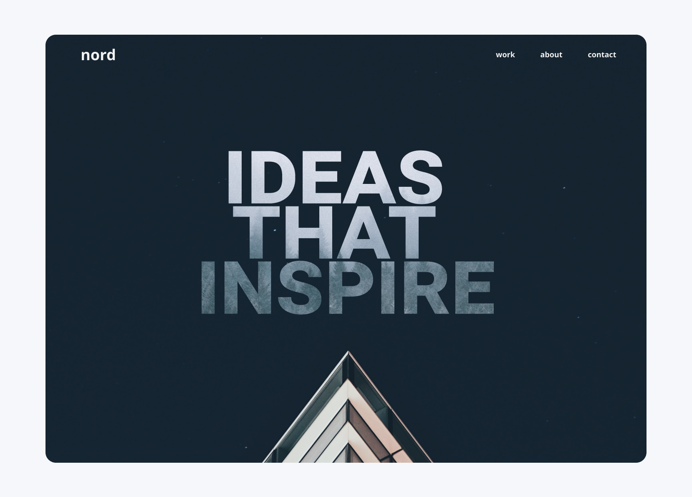
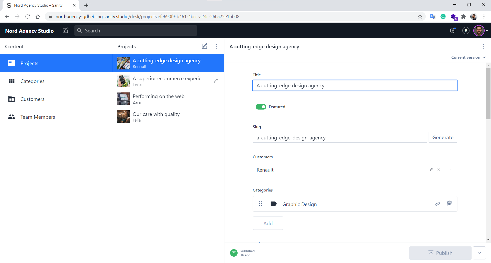
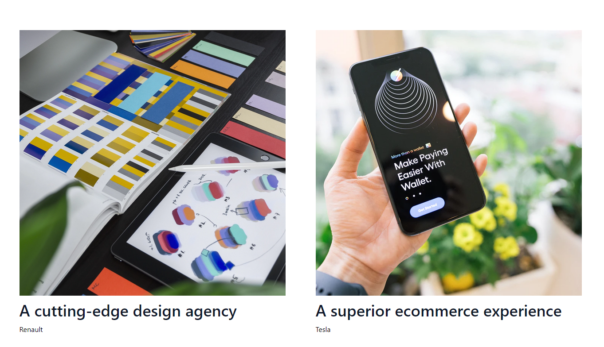

 

  
  
  <h1 align="center">
  nord agency by gdhebling
</h1>

#### Deployed at https://nord-agency-gdhebling.netlify.app/

# 🖥 The Project

### A Gatsby & Sanity website.

Created with Gatsby.js, powered by Sanity as a headless CMS for content management, deployed and hosted to Netlify with a continuous rebuild using Netlify build hooks.

The frontend is built using [Gatsby.js](https://www.gatsbyjs.com/), a popular React-based JavaScript and [Jamstack](https://jamstack.org/) framework.  
The website uses [Sanity.io](https://www.sanity.io/) as a content platform and headless CMS.

The styling uses a combination of styled-components and Tailwind CSS, providing a component-based CSS-in-JS design using the flexibility and quick approach of Tailwind.

## The integration

This combination of Gatsby and Sanity as headless CMS provides better performance, security, and the ability to work with modern technologies for the frontend. Each project card from the website uses content fetched from the CMS via an API using GraphQL.

  

## The building process

### Research

I started the project researching and looking for inspiration using websites such as Dribbble and other renamed agencies from Oslo and other countries of Europe.

### Concept

With those inspirations in mind, I've created a mockup and a final design using Figma.
  

## 🚀 Main technologies

Gatsby.js, Sanity, Netlify, React, GraphQL, styled-components, Tailwind CSS.

&nbsp

&nbsp

## 🎯 Next steps

This project is a work in progress. 🛠  
The next step is to finish all the pages from the Figma design and improve the integration between the CMS and the frontend, creating individual pages for each project.

## Contact

Gui Hebling -  
https://gdhebling.com

&nbsp;&nbsp;

&nbsp;&nbsp;

